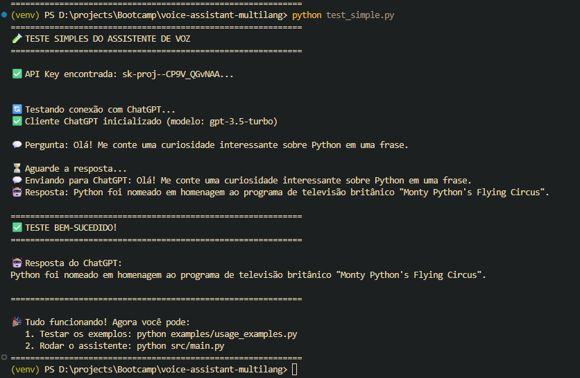
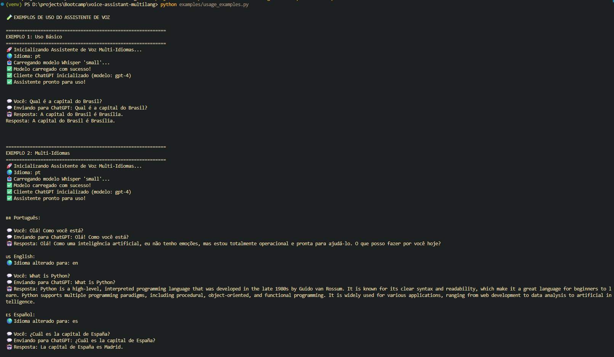
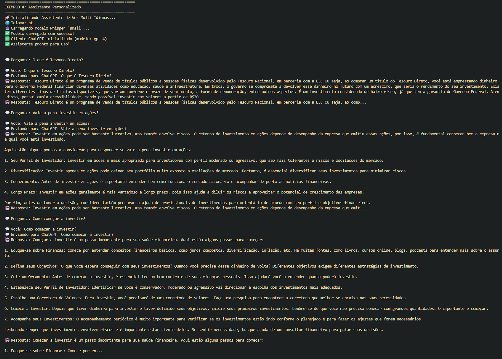
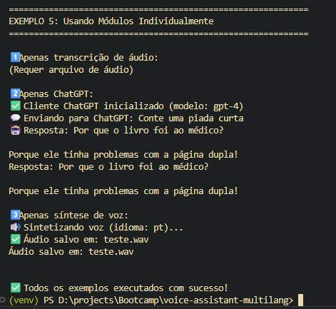
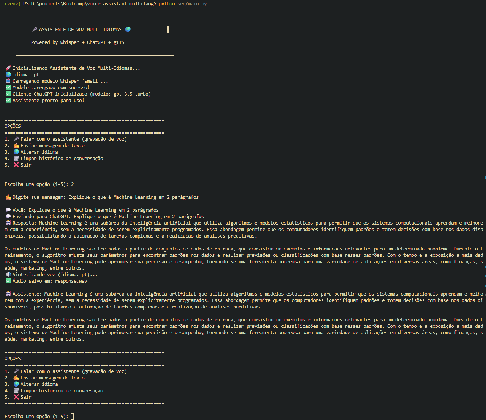
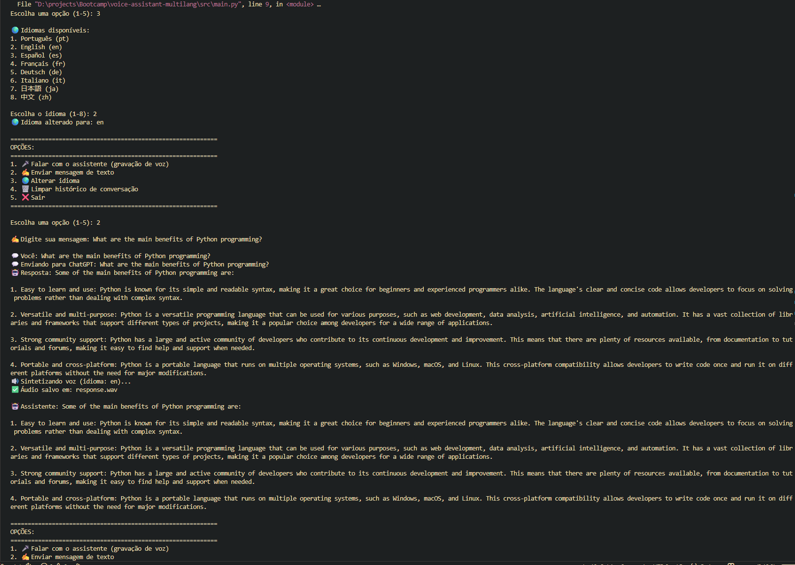
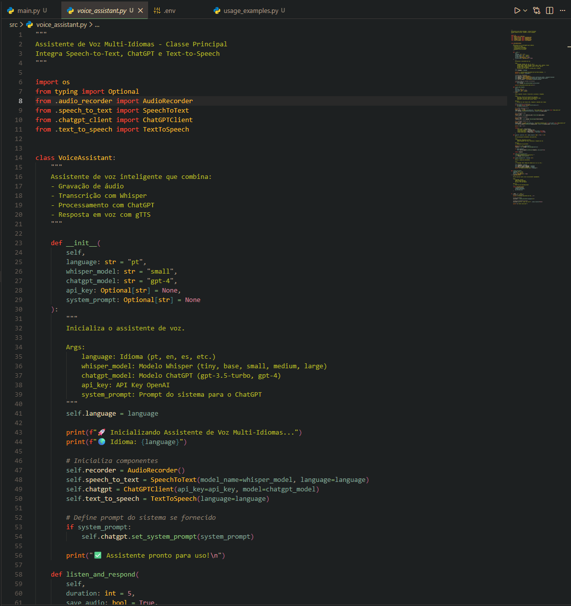
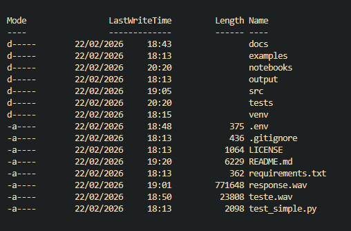

# 🎤 Assistente de Voz Multi-Idiomas com Whisper e ChatGPT

Um assistente de voz inteligente que combina **Speech-to-Text**, **ChatGPT** e **Text-to-Speech** para criar conversas naturais em múltiplos idiomas.

## 🌟 Funcionalidades

- ✅ **Gravação de áudio** via microfone
- ✅ **Transcrição precisa** usando Whisper (OpenAI)
- ✅ **Processamento inteligente** com ChatGPT/GPT-4
- ✅ **Resposta em voz** sintetizada com gTTS
- ✅ **Suporte multi-idiomas** (português, inglês, espanhol, etc.)
- ✅ **Arquitetura modular** e extensível

## 🛠️ Tecnologias Utilizadas

- **Whisper** (OpenAI) - Reconhecimento de fala
- **ChatGPT API** (OpenAI) - Processamento de linguagem natural
- **gTTS** (Google Text-to-Speech) - Síntese de voz
- **PyAudio** / **SoundDevice** - Captura de áudio
- **Python 3.8+**

## 📦 Instalação

### 1. Clone o repositório
```bash
git clone https://github.com/seu-usuario/voice-assistant-multilang.git
cd voice-assistant-multilang
```

### 2. Crie um ambiente virtual
```bash
python -m venv venv
source venv/bin/activate  # Linux/Mac
# ou
venv\Scripts\activate  # Windows
```

### 3. Instale as dependências
```bash
pip install -r requirements.txt
```

### 4. Configure sua API Key da OpenAI
Crie um arquivo `.env` na raiz do projeto:
```env
OPENAI_API_KEY=sua_chave_api_aqui
```

Para obter sua chave:
1. Acesse: https://platform.openai.com/account/api-keys
2. Clique em "Create API Key"
3. Copie e cole no arquivo `.env`

## 🚀 Como Usar

### Modo Interativo (Linha de Comando)
```bash
python src/main.py
```

### Modo Notebook (Jupyter/Google Colab)
```bash
jupyter notebook notebooks/demo.ipynb
```

### Uso Programático
```python
from src.voice_assistant import VoiceAssistant

# Crie uma instância do assistente
assistant = VoiceAssistant(language='pt', model='gpt-4')

# Grave e processe
response = assistant.listen_and_respond(duration=5)
print(f"Resposta: {response}")
```

## 📁 Estrutura do Projeto

```
voice-assistant-multilang/
│
├── README.md                   # Documentação principal
├── requirements.txt            # Dependências Python
├── .env.example               # Exemplo de configuração
├── .gitignore                 # Arquivos ignorados pelo Git
│
├── src/
│   ├── __init__.py
│   ├── main.py                # Script principal
│   ├── voice_assistant.py     # Classe principal do assistente
│   ├── audio_recorder.py      # Módulo de gravação de áudio
│   ├── speech_to_text.py      # Integração com Whisper
│   ├── chatgpt_client.py      # Cliente ChatGPT
│   └── text_to_speech.py      # Síntese de voz com gTTS
│
├── notebooks/
│   └── demo.ipynb             # Notebook de demonstração
│
├── examples/
│   ├── audio_samples/         # Exemplos de áudio
│   └── usage_examples.py      # Exemplos de uso
│
└── tests/
    └── test_assistant.py      # Testes unitários
```

## 🌍 Idiomas Suportados

O assistente suporta todos os idiomas do Whisper:

- 🇧🇷 Português
- 🇺🇸 Inglês
- 🇪🇸 Espanhol
- 🇫🇷 Francês
- 🇩🇪 Alemão
- 🇯🇵 Japonês
- 🇨🇳 Chinês
- E muitos outros...

Para alterar o idioma:
```python
assistant = VoiceAssistant(language='en')  # inglês
assistant = VoiceAssistant(language='es')  # espanhol
```

## 💡 Exemplos de Uso

### Exemplo 1: Pergunta Simples
```python
# Você: "Qual é a capital do Brasil?"
# Assistente: "A capital do Brasil é Brasília."
```

### Exemplo 2: Tradução
```python
# Configure para inglês
assistant = VoiceAssistant(language='en')
# Você: "Translate 'good morning' to Portuguese"
# Assistente: "The translation of 'good morning' to Portuguese is 'bom dia'."
```

## 🔧 Configurações Avançadas

### Modelos Whisper Disponíveis
- `tiny` - Mais rápido, menos preciso
- `base` - Balanceado
- `small` - Recomendado (padrão)
- `medium` - Mais preciso
- `large` - Máxima precisão

### Modelos ChatGPT
- `gpt-3.5-turbo` - Rápido e econômico
- `gpt-4` - Mais inteligente (recomendado)
- `gpt-4-turbo` - Mais rápido que GPT-4

## 🤝 Contribuindo

Contribuições são bem-vindas! Para contribuir:

1. Fork o projeto
2. Crie uma branch para sua feature (`git checkout -b feature/MinhaFeature`)
3. Commit suas mudanças (`git commit -m 'Adiciona MinhaFeature'`)
4. Push para a branch (`git push origin feature/MinhaFeature`)
5. Abra um Pull Request

## 📝 Licença

Este projeto está sob a licença MIT. Veja o arquivo `LICENSE` para mais detalhes.

## 👨‍💻 Autor

**Gleison** - Bootcamp DIO - Python com IA

## 🙏 Agradecimentos

- **OpenAI** - Whisper e ChatGPT API
- **Google** - gTTS
- **DIO** - Bootcamp e inspiração do projeto

## 📧 Contato

Para dúvidas ou sugestões, abra uma issue no GitHub!

---

⭐ Se este projeto foi útil, deixe uma estrela no repositório!

```markdown
## 📸 Screenshots

### Teste de Conexão com API

*Validação da API Key e primeira interação com o ChatGPT*

### Exemplos Multi-Idiomas

*Demonstração do assistente respondendo em Português, Inglês e Espanhol*

### Assistente Financeiro Personalizado

*Exemplo de personalização com system prompt para consultoria financeira*

### Menu Principal Interativo

*Interface CLI com opções de interação por voz e texto*

### Interação em Português

*Assistente explicando Machine Learning em português*

### Modo Multi-Idioma (Inglês)

*Mudança de idioma em tempo real e resposta em inglês*

### Código Fonte - Classe Principal

*Arquitetura modular da classe VoiceAssistant*

### Estrutura do Projeto

*Organização dos arquivos e diretórios do projeto*
